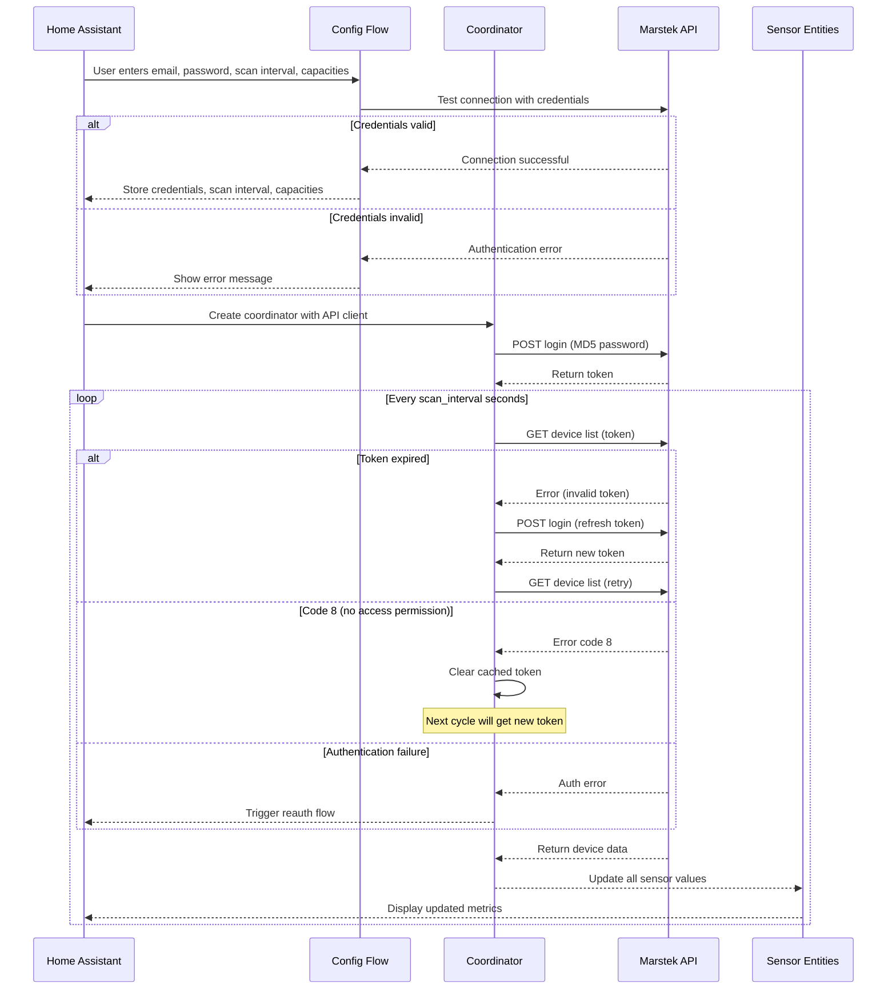

# Marstek Cloud Battery – Home Assistant Custom Integrat## ⚙ Configuration

- **Scan interval** can be set during initial setup and changed later via the integration's **Options** menu.
- **Default battery capacity** (in kWh) can be set for each battery during setup or via the **Options** menu.
- **Flexible options flow** handles scenarios where devices aren't immediately available, allowing scan interval configuration even without connected devices.
- Default capacity is 5.12 kWh.
- Minimum scan interval is 10 seconds, maximum is 3600 seconds.
This custom integration connects your Marstek battery system (via the Marstek cloud API) to Home Assistant, pulling live data and exposing it as sensor entities.

---

## ✨ Features

- **Automatic login & token refresh**  
  Logs in to the Marstek cloud API using your credentials, hashes your password (MD5) before sending, and automatically refreshes the token if it expires.
  
- **Connection validation during setup**  
  Tests your credentials during initial configuration to ensure they work before completing setup.
  
- **Configurable scan interval**  
  Set how often the integration polls the API (10–3600 seconds) during initial setup or later via the Options menu.

- **Battery metrics exposed as sensors**  
  - `soc` – State of charge (%)
  - `charge` – Charge power (W)
  - `discharge` – Discharge power (W)
  - `load` – Load power (W)
  - `profit` – Profit (€)
  - `version` – Firmware version
  - `sn` – Serial number
  - `report_time` – Timestamp of last report
  - `total_charge` – Total charge per device (kWh).

- **Cross-device total charge sensor**  
  - `total_charge_all_devices` – Sum of total charges across all batteries (kWh).

- **Cross-device total power sensor**  
  - `total_power_all_devices` – Net power (charge - discharge) across all batteries (W).

- **Diagnostic sensors**  
  - `last_update` – Time of last successful update
  - `api_latency` – API call duration in milliseconds
  - `connection_status` – Online/offline status

- **Device registry integration**  
  Each battery appears as a device in HA with model, serial number, firmware version, and manufacturer.

- **Editable battery capacity**  
  Configure the default capacity (in kWh) for each battery during setup or later via the Options menu.

---

## 🚀 Recent Improvements

### **Enhanced Reliability & Performance**
- **Improved error handling**: Custom exception types with proper integration into Home Assistant's reauth system
- **Connection validation**: Credentials are tested during setup to ensure immediate feedback
- **Optimized entity creation**: Removed inefficient duplicate checking logic for better performance
- **Enhanced type safety**: Comprehensive type hints throughout the codebase for better maintainability
- **Proper sensor coordination**: All sensors now inherit from CoordinatorEntity ensuring proper update notifications

### **Better User Experience**
- **Flexible configuration**: Options flow now handles scenarios where devices aren't immediately available
- **Improved error messages**: More informative error reporting with specific error types
- **Robust authentication**: Automatic reauth flow triggers when credentials become invalid
- **Better null safety**: Enhanced defensive programming to prevent crashes during edge cases

### **Code Quality Improvements**
- **Modern Python practices**: Full type annotations and consistent coding patterns
- **Reduced redundancy**: Optimized sensor classes with improved data handling
- **Better architecture**: Cleaner separation of concerns and improved maintainability

---

## 🛠 Installation

1. Copy the `marstek_cloud` folder into your Home Assistant `custom_components` directory.
2. Restart Home Assistant.
3. Go to **Settings → Devices & Services → Add Integration** and search for **Marstek Cloud Battery**.
4. Enter your Marstek cloud email, password, and desired scan interval.

---

## ⚙ Configuration

- **Scan interval** can be set during initial setup and changed later via the integration’s **Configure** option.
- **Default battery capacity** (in kWh) can be set for each battery during setup or via the **Options** menu.
- Default capacity is 5.12 kWh.
- Minimum scan interval is 10 seconds, maximum is 3600 seconds.

---

## 🛡️ Error Handling & Resilience

The integration includes robust error handling to ensure reliable operation:

- **Enhanced authentication flow**  
  Custom exception handling that integrates with Home Assistant's reauth system. Authentication failures automatically trigger the reauth flow to update credentials.

- **Connection testing during setup**  
  Validates your credentials before completing the integration setup, providing immediate feedback if there are authentication issues.

- **Automatic token refresh**  
  When API tokens expire or become invalid, the integration automatically obtains a new token and retries the failed request.

- **Code 8 error recovery**  
  When the API returns error code 8 (no access permission), the integration clears the cached token and will automatically obtain a fresh token on the next update cycle.

- **Comprehensive error classification**  
  Distinguishes between authentication errors, network issues, and API errors with appropriate handling for each type.

- **Graceful sensor handling**  
  Sensors continue to function during temporary API issues:
  - Diagnostic sensors (`api_latency`, `last_update`, `connection_status`) continue to report integration health
  - Data sensors properly indicate availability and automatically resume normal operation once connectivity is restored
  - All sensors inherit from CoordinatorEntity ensuring immediate updates after resilience events
  - Sensor availability reflects the actual connection state preventing display of stale data

- **Defensive data validation**  
  All sensor calculations include comprehensive checks for missing or invalid data to prevent crashes during edge cases.

---

## 🔍 Logic Flow

Here’s how the integration works internally:

### 1. **Setup**
- `config_flow.py` collects your email, password, scan interval, and default battery capacities.
- These are stored securely in HA’s config entries.

### 2. **Coordinator & API**
- `__init__.py` creates:
  - An `aiohttp` session for async HTTP calls.
  - A `MarstekAPI` instance for talking to the cloud API.
  - A `MarstekCoordinator` (subclass of `DataUpdateCoordinator`) that schedules periodic updates.

### 3. **Login & Token Handling**
- On first run, `MarstekAPI._get_token()`:
  - MD5‑hashes your password.
  - Sends a POST request to `https://eu.hamedata.com/app/Solar/v2_get_device.php`.
  - Stores the returned `token`.
- On each update, `MarstekAPI.get_devices()`:
  - Calls `https://eu.hamedata.com/ems/api/v1/getDeviceList` with the token.
  - If the API responds with an invalid/expired token, it refreshes and retries once.
  - If the API responds with error code `8` (no access permission), it clears the cached token and logs the error. A new token will be obtained automatically on the next update cycle.

### 4. **Data Fetching**
- The coordinator’s `_async_update_data()`:
  - Records the start time.
  - Calls `api.get_devices()` to fetch the latest battery list.
  - Calculates API latency in milliseconds.
  - Returns the list of devices to all entities.

### 5. **Entity Creation**
- `sensor.py`:  
  - For each device in the API response, creates:  
    - One `MarstekSensor` per metric in `SENSOR_TYPES`.  
    - One `MarstekDiagnosticSensor` per metric in `DIAGNOSTIC_SENSORS`.  
    - One `MarstekDeviceTotalChargeSensor` for the total charge per device.  
  - Creates a `MarstekTotalChargeSensor` for the cross-device total charge.  
  - Each entity has:  
    - A unique ID (`devid_fieldname`).  
    - Device info (name, model, serial, firmware, manufacturer).

### 6. **Updates**
- HA calls `async_update()` on entities when needed.
- Entities pull their latest value from the coordinator’s cached data.
- The coordinator refreshes data on the configured interval or when manually triggered.

---

## 📡 API Endpoints Used

- **Login**:  
  `POST https://eu.hamedata.com/app/Solar/v2_get_device.php?pwd=<MD5_PASSWORD>&mailbox=<EMAIL>`

- **Get Devices**:  
  `GET https://eu.hamedata.com/ems/api/v1/getDeviceList?token=<TOKEN>`

---

## 📊 Sequence Diagram



---

## 🔧 Troubleshooting

### **Setup Issues**
- **Invalid credentials**: The integration will test your credentials during setup and show an error if they're incorrect
- **Connection problems**: Check your internet connection and ensure the Marstek API endpoints are accessible
- **Unknown errors**: Enable debug logging (see below) for more detailed error information

### **Sensors Stop Updating**
- **Check the logs** for error messages about API timeouts or authentication issues
- **Restart the integration** via Settings → Devices & Services → Marstek Cloud Battery → Configure
- **Verify credentials** are still valid by trying to log in to the Marstek web portal
- **Check the connection status sensor** to see if the integration is currently online

### **Authentication Errors**
- **Automatic reauth flow**: Authentication failures will automatically trigger Home Assistant's reauth flow
- **Update credentials**: Go to Settings → Devices & Services → Marstek Cloud Battery → Configure to update your credentials
- **Check account status**: Ensure your Marstek account is active and has proper permissions

### **Code 8 Errors (No Access Permission)**
- This is normal behavior when tokens expire naturally
- The integration automatically recovers by obtaining a new token
- If errors persist, check your account permissions on the Marstek platform

### **API Latency Issues**
- Monitor the `api_latency` sensor to identify network issues
- Consider increasing the scan interval if you see consistent high latency
- Check your internet connection and firewall settings

### **Missing Devices**
- Ensure devices are properly registered and online in the Marstek cloud platform
- Check device permissions in your Marstek account
- The options flow will show a helpful message if no devices are found
- Restart Home Assistant if devices don't appear after initial setup

### **Configuration Issues**
- **Missing device options**: If you don't see device-specific options, ensure devices are properly connected and visible in the Marstek platform
- **Scan interval not updating**: Changes to scan interval require a restart of the integration

### **Debugging**
- Enable debug logging by adding this to your `configuration.yaml`:
  ```yaml
  logger:
    logs:
      custom_components.marstek_cloud: debug
  ```
- Check logs at Settings → System → Logs or in `config/home-assistant.log`
- Look for specific error types: `MarstekAuthError` (authentication), `MarstekAPIError` (API communication), or `UpdateFailed` (general update issues)
